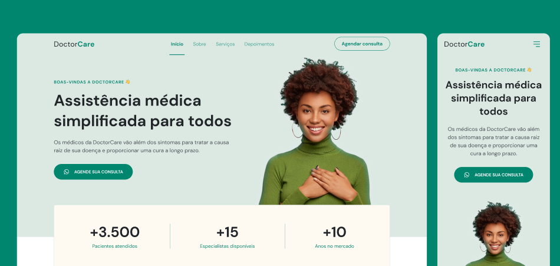

# DOCTOR CARE

 

Deploy: https://paru369.github.io/doctorcare/
Página web criada em HTML e CCS e JavaScritp partir de layout no figma.
Desafio do NLW da  da Rockeseat. 

Figma https://www.figma.com/file/0OuLNi7z83yeoeUdohXcfs/DoctorCare-(Community)?node-id=0%3A1

## 🚀 Começando - 

DoctorCare é uma página institucional no formato One Page, responsiva, para usar em diversos tipos de empresas. 
Deploy: https://paru369.github.io/doctorcare/

Executar index.html

Deploy: 

### 📋 Pré-requisitos

Executável em qualquer navegador

### 🔧 Instalação

Não carece de instalação

## 📦 Desenvolvimento

É uma página HTML estilizada em CSS, aplicável em qualquer sistema WEB

## 🛠️ Construído com

HTML | CSS | JS

## 📌 Versão

Versão única

## ✒️ Autores

 * **NLW Rocketseat**

* **Paulo Victor Pinheiro** - *Trabalho Inicial* - [Paru - Paulo Victor](https://www.linkedin.com/in/paulo-pinheiro-4a94b0150/)

## 🎁 Agradecimentos

* Gratidão à equipe Rocketseat

---
⌨️ com ❤️ por [Paulo Victor](https://gist.github.com/Paru369) 😊
